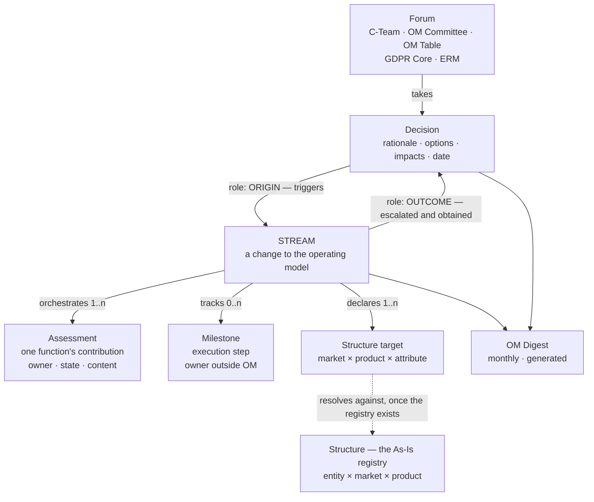
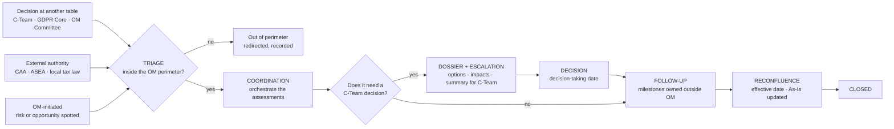
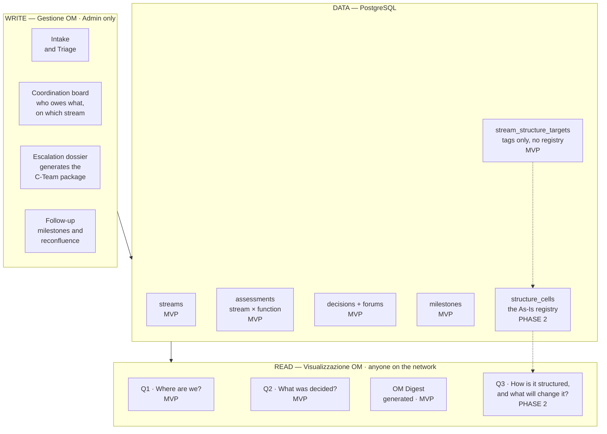
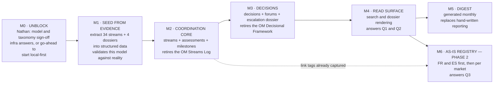

# OM Domain Maps — concept, architecture, milestones

**Status: proposal, 3 August 2026.** Written after reading the four real source documents (`OM Office Perimeter and Governance`, `OM Streams Log`, `OM Decisional Framework`, `OM Market Architecture`). It is not yet validated by Diane, and it does not yet replace anything in `docs/`.

Read it in order. The three maps build on each other: Map 1 says *what the objects are*, Map 2 says *what we build and in which order*, Map 3 says *what unblocks what*.

---

## 0. Why this document exists

The specs currently in `docs/` model **the document**, not **the process**. The OM Streams Log is one flat list of tabs, so `PRODUCT_SPEC.md` became one table (`om_catalog`, ~20 columns) with a Kanban on top. That flattening loses three things that are visible in the real source material:

1. **The trigger.** Most streams do not start inside OM. They start with a decision taken at another table, or an external authority, and land on OM as an impact to absorb.
2. **The functional contribution.** The unit of work OM actually chases is not the stream — it is *one function's input on one stream* (Legal, Tax, DPO, Finance, HR, IT, Corporate Affairs, ERM…). This has no representation in the current schema.
3. **The reconfluence.** A stream is not done when a decision is taken. It is done when the operating model has absorbed the change. This is the OM Office's own stated accountability: *"Chasing execution milestones after C-Team decisions"*.

### The evidence behind the reframe

| What the current spec says | What the source documents show |
|---|---|
| Driver enum: `OM Compliance`, `OM Evolution`, `OM Efficiency`, `OM Optimisation` | The 34 real stream tabs are already tagged, consistently: **OM Governance** (24), **OM Market Expansion** (5), **OM Efficiency** (3), **OM Compliance** (2). `OM Optimisation` does not exist. `OM Governance` — the largest group — is missing from the spec. |
| `DetailSections`: 5 fixed categories plus one ancillary | An open set of functional contributions. Observed so far: Legal · Fiscal/Tax · DPO · Finance · HR · IT and Platform · Corporate Affairs · Enterprise Risk Management · Accountancy · FCP Business Analysis · Content Management and UX · Social, Copy and App · Cyber Security and PCI · VS/Business · Marketing |
| `Effective date` maps to `EndDate`, i.e. stream closure | `Effective date` is when the **change comes into force**, and it can be phased. Greece has two: 13/08/2025 (phase 1) and 01/06/2026 (phase 2). Separate from `Go-live date` (technical deployment) and `Decision-taking date`. |
| One `Completeness %`, a manual subjective slider | Two different progress dimensions: assessment completeness during coordination, execution completeness after the decision. One slider trying to be both is why it felt arbitrary. |
| Streams Log and Decisional Framework are one dataset | Two documents with **different templates** for overlapping topics. Greece, PT and LMNext US each appear in both, described differently. This is drift being maintained by hand. |

One consequence worth stating plainly: the Streams Log records **contributions by function** ("Legal:", "Fiscal:", "DPO:"), while the Decisional Framework records **impacts by dimension** ("Financial impacts", "Legal and DPO impacts", "Reputational impacts"). Same underlying content, two framings, two audiences. The model below keys the record by function and treats impact type as a facet — see Open Questions.

---

## 1. Map 1 — Concept

### 1.1 What a Stream is

> A **Stream** is a change to the operating model, from the moment it is triggered to the moment the operating model has absorbed it.

Not "an OM activity". Not a project — the Perimeter document is explicit that OM is *"not a replacement for Project Managers"* and does *"not manage vertical business content"*. Streams carry milestones, but **a milestone's owner is normally outside OM**: OM is accountable for visibility on it, not for delivering it.

### 1.2 The objects

`Decision` is a single object that attaches to a stream in one of two **roles**. That is what makes both directions expressible with one model:

- **origin** — a decision taken elsewhere that spawned the stream (`LMNext US Data Privacy` ← GDPR Core, 15/09/2025)
- **outcome** — a decision OM built the dossier for and obtained (`Bravonext DE Seller switch` ← OM Committee, 14/07/2025)

A stream can have both. `LMNext PT` started from the Portuguese regulator's objection and produced a C-Team decision on compliance priority.

### 1.3 The lifecycle

Reconfluence can be **phased** — a stream reaches it more than once before closing. Greece is the worked example. This is why closure and effective date are different fields.

### 1.4 The three questions the data has to answer

Everything above exists to serve one write workflow and three read questions.

| | Question people actually ask | Objects needed | Served today by |
|---|---|---|---|
| **Q1** | "Where are we on X?" | Stream + Assessment states + Milestones | Streams Log — badly, state lives in prose |
| **Q2** | "What was decided on Y, and why?" | Decision + Forum + rationale + impacts | Decisional Framework — well, but not searchable |
| **Q3** | "How is Z structured today, and what is in flight that would change it?" | Structure × Structure target × Stream | **Nobody. You ask Diane.** |

Q3 is the highest-value question — it is the Perimeter document's continuity promise, *"new leaders get up to speed in days, not months"*. It is also **derived**: it needs no new feature beyond the registry plus the link. Model Q1 and Q2 properly and Q3 becomes a join.

Design consequence: the primary read interaction is **search and lookup by topic, market, entity or product** — not a filtered card dashboard. Someone asking "what was decided about telesales" arrives with a subject in mind, not a filter combination. And the narrative is the payload: the reason people consult the Doc rather than asking Diane is that each tab is a readable, self-contained dossier. An app that reduces that to fields and a percentage loses to the Doc.

---

## 2. Map 2 — Architecture

### 2.1 Layers and the MVP boundary

### 2.2 Why the As-Is registry is out of the MVP

Not a stack decision — a **content** one. The Market Architecture document covers **FR and ES only**, and both need normalising before they are queryable. Populating the registry for every market means Diane first running a manual collection across Legal, Tax and DPO — the manual process she already identified in July. No choice of database or hosting removes that dependency.

**But the link field goes in from day one.** `stream_structure_targets` — a stream tagging which cells it touches, as `market × product × attribute` (example: *DE × Dynamic Package × selling company*) — costs almost nothing, needs no registry to exist, and is the one thing that would otherwise have to be backfilled across 34 streams later. It must be a tag against controlled lists, never free text, or it will not get filled in.

What deferring Phase 2 actually costs: the MVP delivers **coordination and retrieval** (Q1, Q2) and retires two hand-maintained documents. The organisation-level continuity promise (Q3) lands in Phase 2.

Related: the registry, when it comes, is the queryable version of the **OM Handbook** — today prose on a Google Site, plus the B2C spreadsheet. It has to replace those sources, not become a third place.

### 2.3 Field-level corrections carried into the schema

| Field | Correction |
|---|---|
| `Driver` | Enum becomes `OM Governance`, `OM Market Expansion`, `OM Efficiency`, `OM Compliance` — counted from the real tags, not designed. Remains a tag, not a filter. |
| `Status` | Real values are `TO DO`, `IN PROGRESS`, `PAUSED`, `DONE`. Current spec invented `New`. |
| `DetailSections` | Replaced by `assessments`: one row per function, with owner, state (`requested` / `received` / `blocking` / `no impact`) and content. |
| `Completeness %` | Removed as a manual field. Derived twice: assessment completeness, execution completeness. |
| Dates | Three distinct: `decision_taking_date`, `effective_date` (repeatable — phased reconfluence), `go_live_date`. Closure is its own event, not `Effective date`. |
| `Trigger` | New. Origin type plus a link to the originating `Decision` and `Forum`. Absent from the current spec entirely. |
| `Requester` | Absorbed into the trigger. It was already only descriptive. |

### 2.4 What survives from the current specs

The **behavioural** decisions in `PRODUCT_SPEC.md` are sound and carry over unchanged: single Admin role, no login with network-level read access, draft/publish one-way, Admin Kanban with manual ordering, read-only version history, no delete and no rollback, two notification audiences, taxonomy stays a config file. What changes is the data model and the taxonomy underneath them.

---

## 3. Map 3 — Milestones

Each milestone is measured by a document it retires, not by hours spent.

| | Milestone | Done when | Blocked by |
|---|---|---|---|
| **M0** | Unblock | This model and the 4-value taxonomy are signed off; the seven infra questions of 30 July are answered, **or** Diane is authorised to build local-first while they are resolved | Nathan |
| **M1** | Seed from evidence | All 34 streams and 4 dossiers exist as structured data, and every field in the model is populated from something actually written in the sources. **A field that cannot be filled from the evidence gets cut.** | M0 sign-off only — not infra |
| **M2** | Coordination core | Diane runs a full week of OM coordination in the app without opening the Streams Log | M1 · hosting or local |
| **M3** | Decisions | The next C-Team escalation package is produced from the app | M2 |
| **M4** | Read surface | Someone outside OM finds "what was decided on telesales" without asking Diane | M2 · M3 |
| **M5** | Digest | The monthly Digest is generated, then edited — not written | M4 |
| **M6** | As-Is registry | "Who is the Principal for Hotel NET in ES today, and what is in flight that would change it" is answerable for FR and ES | M4 · the manual data collection |

**M1 is the cheap high-leverage step and it is not blocked by infrastructure.** It tests the model against 34 real cases before any schema is committed, and it doubles as the import seed. If the model is wrong, M1 is where that surfaces — at the cost of a day, not a sprint.

---

## 4. Open questions

### For Diane

1. **Assessment keyed by function or by impact?** The Streams Log records contributions by function; the escalation package records impacts by dimension. Recommendation: key by function, add an impact-type facet, and let the C-Team view group by impact. Needs your confirmation — it decides the shape of the central table.
2. **Is the function list closed or open?** Fifteen observed so far. A controlled list makes "who owes what" queryable; an open one means the coordination board cannot be trusted. Recommendation: controlled list, with adding a function an explicit config change.
3. **Which attributes of the As-Is are actually changed by streams?** Needed to define the `market × product × attribute` tag vocabulary in M2, well before the registry exists. From the Market Architecture: selling company, principal, invoice issuer, revenue model, VAT regime, liability model, insolvency cover, data controller, licences. Complete or trim this list.
4. **Does `Stream` stay the name?** Recommendation: yes. It is installed vocabulary, the C-Team recognises it, and 34 streams are documented under it. Change the definition, not the label. If a name must signal the reconfluence, the only alternative worth considering is `OM Change` — not "project".

### For Nathan

1. Sign-off on this model and on the 4-value taxonomy — currently blocking, and cheap to resolve.
2. The seven stack and infrastructure questions of 30 July (`conversations/2026-07-30-domande-per-nathan-stack-infra.md`).
3. Authorisation to start M1 and M2 local-first, without waiting for hosting.
4. The Admin recognition mechanism: Google Sign-In restricted to two `@lastminute.com` addresses, versus a bespoke token.

---

## 5. What this supersedes, once validated

Nothing in `docs/` has been modified. On validation, this document supersedes: the data model in `docs/ARCHITECTURE.md`, the `Driver` enum and `DetailSections` in `docs/PRODUCT_SPEC.md`, the driver definitions in `config/clusters.json`, and the Domain B dashboard layout in `PRODUCT_SPEC.md` §2.1 (already flagged as pending rework). `docs/MVP_ROADMAP.md` is replaced by Map 3.
